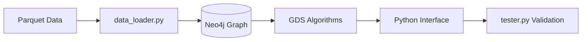

# 🚀 Neo4j Graph Data Science with Docker
### PageRank & BFS on NYC Yellow Taxi Data


---

## 🎯 Project Objective

This project demonstrates the deployment of a **Dockerized Neo4j 5.5.0 instance** integrated with the **Graph Data Science (GDS) plugin v2.15.0**. The system executes high-performance graph algorithms, specifically **PageRank** and **Breadth-First Search (BFS)**, on real-world transit data.

**Dataset:** NYC Yellow Taxi – March 2022 (Parquet format).

**Key Goals:**
* Configure and optimize Neo4j + GDS within a containerized environment.
* Transform structured Parquet trip data into a graph schema.
* Implement Python-based interfaces for algorithm execution.
* Validate results using a standardized `tester.py` suite.

---

## 🛠️ Tools & Technologies Used

* **Infrastructure:** 🐳 Docker
* **Database:** 🧠 Neo4j 5.5.0
* **Analytics:** 🧩 Graph Data Science (GDS) v2.15.0
* **Language:** 🐍 Python 3.11
* **Data:** 📊 NYC Yellow Taxi TripData (March 2022)
* **Libraries:** `pandas`, `pyarrow`, `neo4j`

---

## 🧱 System Architecture



---

## ⚙️ Dockerfile: Optimization & Plugin Integration

A custom Dockerfile was engineered to handle both the database environment and data dependencies efficiently.

### ✅ Sparse Checkout (Optimized Build)
To keep the image lightweight, we utilize **sparse checkout** to pull only the specific data files needed for the project rather than the entire history of the repository.

```dockerfile
RUN git clone --depth=1 --filter=blob:none --sparse \
    https://github.com/SP-2025-CSE511-Data-Processing-at-Scale/Project-1-gmarimu1.git /cse511 \
    && cd /cse511 \
    && git sparse-checkout init --cone \
    && git sparse-checkout set data_loader.py yellow_tripdata_2022-03.parquet
```

### 📦 GDS Plugin Installation
The Graph Data Science plugin is installed directly into the Neo4j plugins directory:

```dockerfile
RUN wget https://graphdatascience.ninja/neo4j-graph-data-science-2.15.0.zip && \
    unzip neo4j-graph-data-science-2.15.0.zip && \
    mv neo4j-graph-data-science-2.15.0.jar /var/lib/neo4j/plugins/
```

---

## 📈 Graph Schema Design

### Nodes
* **Location**: Represents Taxi Zones (Property: `name`)

### Relationships
* **TRIP**: Connects two Locations.
    * *Properties:* `distance`, `fare`, `pickup_dt`, `dropoff_dt`

---

## 📊 Implemented Algorithms

### 1. PageRank (Weighted)
Used to rank the importance of locations based on trip connectivity, weighted by trip distance.
* **Damping Factor:** 0.85
* **Iterations:** 20
* **Weight Property:** `distance`

### 2. Breadth-First Search (BFS)
Computes the shortest path (minimum hops) between two taxi zones. This implementation was updated to resolve GDS 2.15.0 deprecations by using `MATCH + id(n)` instead of legacy node ID calls.

---

## 🐞 Debugging Journey

| Error Message | Root Cause | Fix |
| :--- | :--- | :--- |
| `gds.graph.nodeId unknown` | Deprecated in GDS 2.15.0 | Replaced with Cypher `MATCH + id(n)` |
| `NoneType not subscriptable` | Missing record in return | Added null validation in Python |
| `Path not subscriptable` | Incorrect indexing | Accessed `.nodes` property directly |
| `Failed to parse sourceNode` | String passed instead of Int | Cast numeric ID via Cypher |

---

## 🚀 Getting Started

### 1. Build the Image
```bash
docker build -t neo4j-gds .
```

### 2. Run the Container
```bash
docker run -it -p 7474:7474 -p 7687:7687 neo4j-gds
```

### 3. Access the Tools
* **Neo4j Browser:** [http://localhost:7474](http://localhost:7474)
* **Bolt Protocol:** `bolt://localhost:7687`

---

## 🧪 Validation
To run the automated test suite inside the container:
```bash
python3 tester.py
```
**Expected Output:**
```text
Testing PageRank...
PageRank Test 1: PASS

Testing BFS (Source 159 -> Target 212)...
BFS Test 2: PASS
```

---

## 📁 Repository & Attribution
**Project Link:** [Neo4j-Graph-Data-Science-with-Docker-Implementation-](https://github.com/mganesh1610/Neo4j-Graph-Data-Science-with-Docker-Implementation-)

*Developed as part of the Data Science & Engineering curriculum at Arizona State University.*
